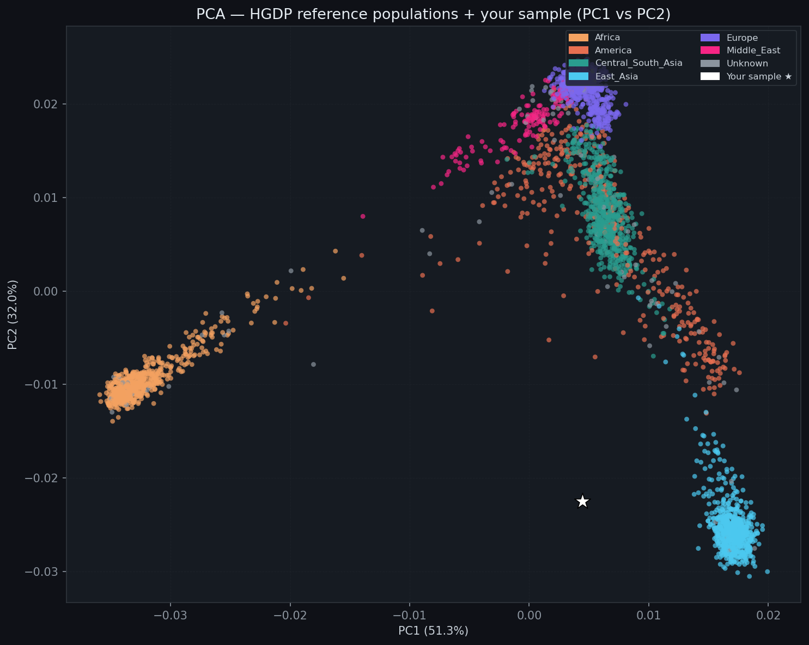
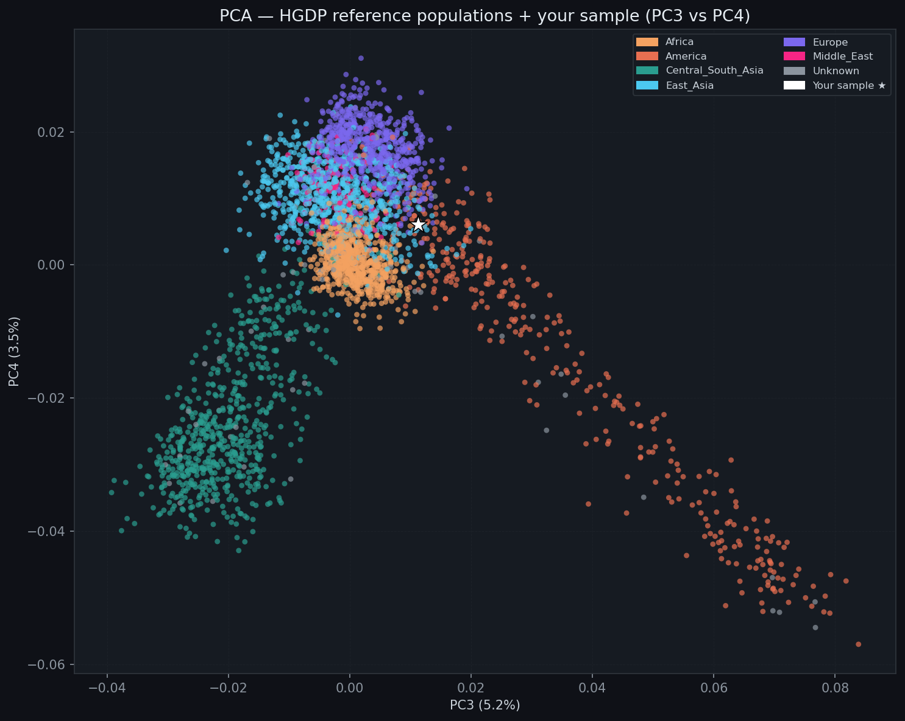
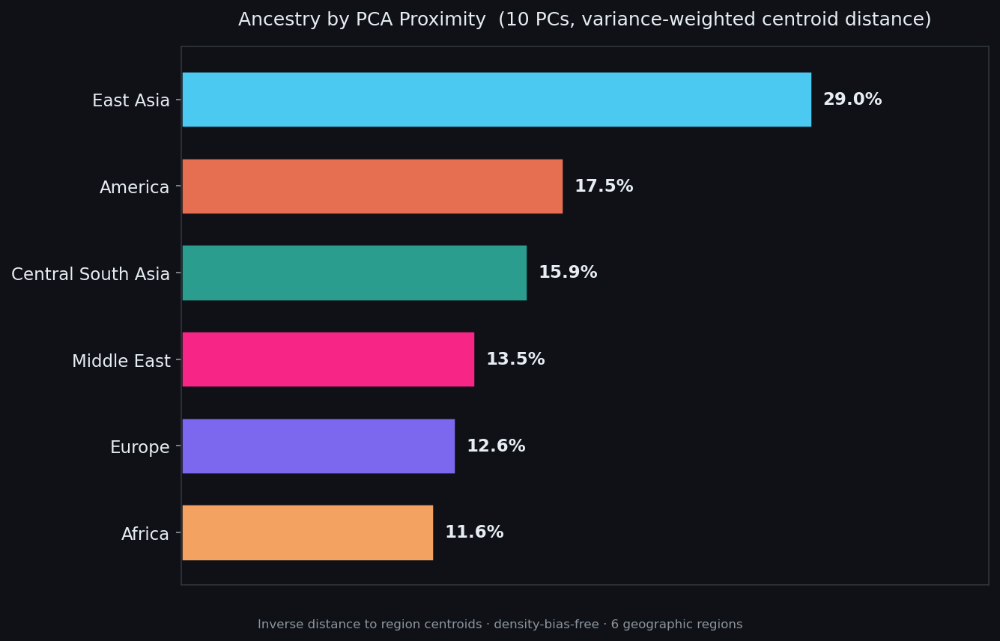
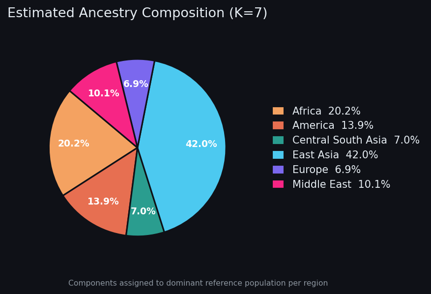
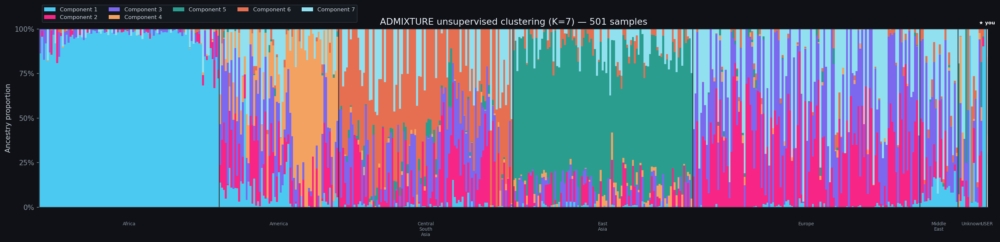

# diy-dna-ancestry

~~家用~~ DNA 祖源分析工具

A DIY tool for personal DNA ancestry analysis

To be honest, this is a lazy tool with no original bioinformatics insight. It automates what you could do yourself by running PLINK and ADMIXTURE directly. If you are comfortable with the command line, you probably do not need it.

## Example and algorithm

The following outputs are generated from a real DNA test file (~190k variants, iWES, nuclear genome 129.38X average depth, 99.64% at ≥20X coverage).

### PCA: PC1 vs PC2



**Algorithm:** Principal Component Analysis (PCA) is run via PLINK on the merged dataset (user + ~3,000 HGDP reference individuals). Each dot is one person; axes are the top two linear dimensions of genetic variation. PC1 (51%) separates African from non-African populations; PC2 (32%) separates East Asian from European/South Asian. The white star (★) marks your sample. This plot gives a lossless map of where you sit in global genetic space.

### PCA: PC3 vs PC4



**Algorithm:** Same PCA, viewed along PC3 (5.2%) and PC4 (3.5%). These lower-variance axes reveal finer structure, separating Native American from East Asian, and Middle Eastern from European. Because these axes capture within-Eurasian variation, they often reveal more nuanced placement than PC1/PC2 alone.

### Ancestry by PCA Proximity



**Algorithm:** For each of the 7 HGDP geographic regions, a **centroid** is computed as the mean PC coordinates of all reference individuals in that region. The user's ancestry proportions are estimated by **inverse-distance weighting**: each region's score is `1 / d`, where `d` is the variance-weighted Euclidean distance from the user to that region's centroid (each PC weighted by its fraction of explained variance). Scores are normalised to 100%. This method is **density-bias-free**: a region with many reference samples is not favoured over one with few, unlike KNN.

### Ancestry Pie Chart (best K by CV error)



**Algorithm:** After ADMIXTURE runs at multiple K values, the K with the **lowest cross-validation (CV) error** is selected automatically. The pie chart is generated only for that best K. Each ADMIXTURE component is mapped to geographic regions using **soft assignment**: the component's mean Q-values across reference populations are used as weights, so a component that loads on multiple regions is split proportionally rather than hard-assigned to a single winner.

### ADMIXTURE Bar Chart (K = 7)



**Algorithm:** ADMIXTURE fits a binomial likelihood model assuming `K` discrete ancestral populations. Each bar represents one individual; coloured segments show the proportion of ancestry from each of the `K` inferred components. Individuals are sorted by geographic region. The user's bar (★) shows which global components contribute to their genome. K = 7 is used here because it matches the 7 HGDP geographic super-regions, giving the cleanest component-to-region correspondence.

### Interpreting the results: Proximity chart vs Pie chart

These two charts answer **different questions** and are best read together.

|                                     | **Ancestry by PCA Proximity**                                      | **Ancestry Pie Chart (ADMIXTURE)**                                                             |
| ----------------------------------- | ------------------------------------------------------------------ | ---------------------------------------------------------------------------------------------- |
| Question answered                   | "Which region's average genome is geometrically closest to yours?" | "What fraction of your genome's SNP frequencies can be explained by each ancestral component?" |
| Data used                           | Top 10 PCs (summary of all SNPs)                                   | All ~20,000 SNPs directly                                                                      |
| Statistical model                   | Inverse distance to region centroids                               | Binomial likelihood (admixture model)                                                          |
| Affected by K choice                | No                                                                 | Yes (wrong K inflates some regions)                                                            |
| Affected by reference panel density | No (centroid-based, density-bias-free)                             | No                                                                                             |
| Academic standard                   | No                                                                 | Yes                                                                                            |

**When they agree:** the result is reliable: both geometric proximity and allele-frequency modelling point to the same ancestry profile.

**When they disagree:** check the K value (use the one with the lowest CV error) and inspect the ADMIXTURE bar chart. A large "Africa" or "America" slice in the pie chart at low K (e.g. K=5) is usually a sign of K being too small; the proximity chart is more stable in this case.

> [!TIP]
> As a rule of thumb: trust the **proximity chart** for an intuitive first read, and trust the **pie chart** (at the best K) for a statistically rigorous breakdown. If both give similar percentages, you can be confident in the result.

## Requirements

- [Anaconda](https://www.anaconda.com/download) or [Miniconda](https://docs.conda.io/en/latest/miniconda.html)
- The `.vcf` file from a DNA test

> [!NOTE]
> **Apple Silicon:** `setup.sh` auto-sets `CONDA_SUBDIR=osx-64` so PLINK and ADMIXTURE resolve from bioconda and run transparently via Rosetta 2.

## Setup

```bash
bash setup.sh
conda activate dna-ancestry
```

## Full commands

```
dna init                              # check environment (conda, PLINK, ADMIXTURE)
dna download                          # download HGDP reference panel
dna run --vcf FILE [options]          # run the full pipeline
dna plot --results DIR                # re-plot from existing results
```

| Flag              | Default      | Description                                                                                   |
| ----------------- | ------------ | --------------------------------------------------------------------------------------------- |
| `--vcf`           | _(required)_ | Input VCF file                                                                                |
| `--k`             | `5,7,9`      | ADMIXTURE K values. K=7 matches the 7 HGDP regions (recommended max). K>12 risks overfitting. |
| `--threads`       | `4`          | Parallel threads                                                                              |
| `--out`           | `results/`   | Output directory                                                                              |
| `--geno`          | `0.05`       | Genotype missingness threshold                                                                |
| `--maf`           | `0.01`       | Minimum allele frequency                                                                      |
| `--hwe`           | `1e-6`       | Hardy-Weinberg p-value cutoff                                                                 |
| `--skip-plot`     | (flag)       | Skip the plotting step                                                                        |
| `--nmf-fallback`  | (flag)       | Enable NMF approximation if ADMIXTURE crashes (see note below)                                |
| `--admixture-bin` | `admixture`  | Path to ADMIXTURE executable (override for non-default installs)                              |

> [!WARNING]
> If ADMIXTURE crashes with a **segfault (SIGSEGV)**, the most common cause is the
> default stack size limit being too small. Try running with an unlimited stack first:
>
> ```bash
> ulimit -s unlimited
> ```
>
> If the crash persists, `--nmf-fallback` is available as a last resort.
> **However, NMF results may be significantly inaccurate**. NMF is a rough
> mathematical approximation that does not model the binomial likelihood of SNP
> data the way ADMIXTURE does. Ancestry proportions from NMF can be misleading
> and should **not** be used for any serious interpretation.

## Pipelines


> [!NOTE]
> LD pruning requires ≥2 samples and is automatically skipped for single-sample VCFs (the typical personal-use case). SNP selection is effectively handled by the HGDP merge step, which intersects your variants with the already LD-pruned reference panel.

## Output structures

```
results/
├── pca_PC1_PC2.png          # PCA scatter plot (PC1 vs PC2)
├── pca_PC3_PC4.png          # PCA scatter plot (PC3 vs PC4)
├── pca_ancestry_knn.png     # Ancestry by PCA proximity (K nearest neighbours)
├── admixture_K5.png         # ADMIXTURE bar chart, K=5
├── admixture_K7.png         # ADMIXTURE bar chart, K=7
├── admixture_K9.png         # ADMIXTURE bar chart, K=9
├── ancestry_pie_K?.png      # Ancestry pie chart (best K only, lowest CV error)
├── cv_error.png             # CV error curve (best-K selection)
├── pca/
│   ├── pca.eigenvec
│   └── pca.eigenval
└── admixture/
    ├── admix.5.Q
    ├── admix.7.Q
    ├── admix.9.Q
    └── admixture_K*.log
```

> [!NOTE]
> **Choosing the right K:** The pipeline runs ADMIXTURE at multiple K values and outputs a
> `cv_error.png` cross-validation error curve. **Use the K with the lowest CV error** as your
> primary result: that K best fits the data without overfitting. Read the ancestry bar chart
> and pie chart for that K; results at other K values are shown for comparison only.
>
> If the CV error curve keeps decreasing with no clear minimum, try adding larger K values
> (e.g. `--k 5,7,9,11`). If it has multiple minima, prefer the smallest K at a local minimum
> (simpler model, less prone to spurious population splits).

## Reference panel

- Dataset: HGDP + 1KG from [gnomAD v3.1.2](https://gnomad.broadinstitute.org/downloads#v3-hgdp-1kg)
- Download: [Zenodo 10.5281/zenodo.14286454](https://doi.org/10.5281/zenodo.14286454) pre-formatted BED/BIM/FAM by GIANT consortium
- Samples: ~3,000 unrelated, AF > 1%, HWE p < 1e-12

## Tools

- [PLINK 1.9](https://www.cog-genomics.org/plink/1.9/)
- [ADMIXTURE 1.3](https://dalexander.github.io/admixture/)

## Development

```bash
conda activate dna-ancestry
pytest tests/ -v
```

## Disclaimer

1. This tool isn't for medical purposes, and not reliable for any medical decisions.
2. This tool may present imprecise results due to the limited reference panel.
3. This tool doesn't collect or store any personal data. All the analysis is done locally.

## Further steps

For the detailed gene mutation analysis, you can play with [OpenCRAVAT](https://opencravat.org/).

## TODO

- [ ] Optional replacement: fastSTRUCTURE
- [ ] Support for raw data

## License

This project's source code is released under the **MIT License**.

> [!IMPORTANT]
> PLINK 1.9 and ADMIXTURE 1.3 are called as external tools and are **not** bundled with this repository. Both are free for academic and non-commercial use under their own terms. Commercial use requires contacting the respective authors.
