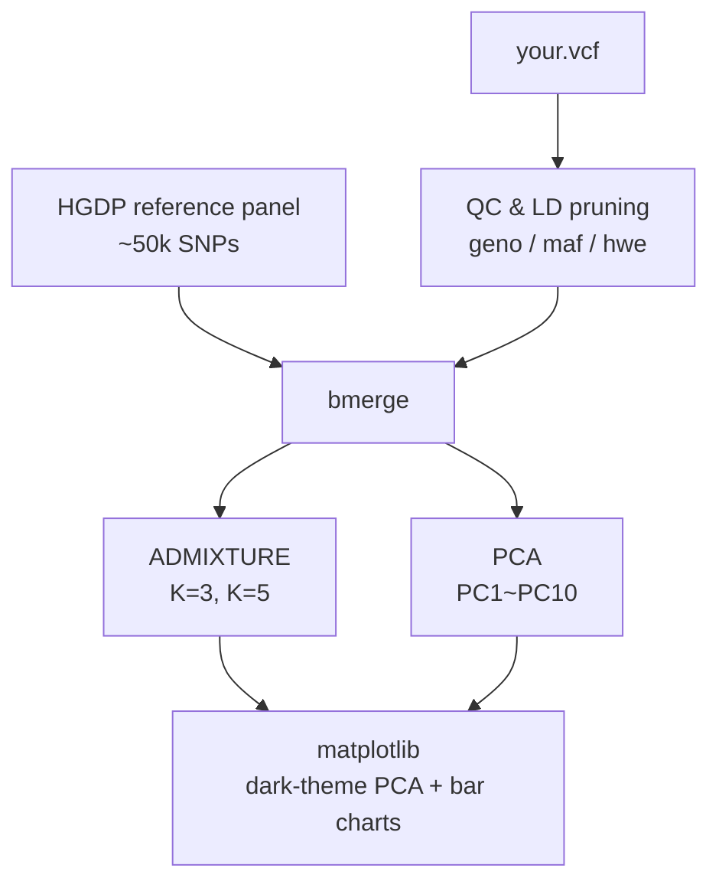

# diy-dna-ancestry

~~家用~~ DNA 祖源分析工具

A DIY tool for personal DNA ancestry analysis

⚠️ Work in progress still

## Requirements

- [Anaconda](https://www.anaconda.com/download) or [Miniconda](https://docs.conda.io/en/latest/miniconda.html)
- The `.vcf` file from a DNA test

> [!NOTE]
> **Apple Silicon:** `setup.sh` auto-sets `CONDA_SUBDIR=osx-64` so PLINK and ADMIXTURE resolve from bioconda and run transparently via Rosetta 2.

## Setup

```bash
bash setup.sh
conda activate dna-ancestry
```

> [!WARNING]
> **WSL (Windows Subsystem for Linux):** ADMIXTURE 1.3 may crash with SIGSEGV under WSL2.
> Use `--nmf-fallback` as a workaround, or run natively on Linux/macOS.

## Pipelines



> [!NOTE]
> LD pruning requires ≥2 samples and is automatically skipped for single-sample VCFs (the typical personal-use case). SNP selection is effectively handled by the HGDP merge step, which intersects your variants with the already LD-pruned reference panel.

## Full commands

```
dna init                              # check environment (conda, PLINK, ADMIXTURE)
dna download                          # download HGDP reference panel
dna run --vcf FILE [options]          # run the full pipeline
dna plot --results DIR                # re-plot from existing results
```

| Flag               | Default      | Description                                                    |
| ------------------ | ------------ | -------------------------------------------------------------- |
| `--vcf`            | _(required)_ | Input VCF file                                                 |
| `--k`              | `3,5`        | ADMIXTURE K values, comma-separated                            |
| `--threads`        | `4`          | Parallel threads                                               |
| `--out`            | `results/`   | Output directory                                               |
| `--geno`           | `0.05`       | Genotype missingness threshold                                 |
| `--maf`            | `0.01`       | Minimum allele frequency                                       |
| `--hwe`            | `1e-6`       | Hardy–Weinberg p-value cutoff                                  |
| `--skip-plot`      | —            | Skip the plotting step                                         |
| `--nmf-fallback`   | —            | Enable NMF approximation if ADMIXTURE crashes (see note below) |
| `--admixture-bin`  | `admixture`  | Path to ADMIXTURE executable (override for non-default installs) |

> [!WARNING]
> `--nmf-fallback` enables a **Python NMF approximation** when the ADMIXTURE 1.3 binary
> exits with a segfault (SIGSEGV), which can happen on certain CPU/OS combinations
> (e.g. WSL2, or ARM Macs under some Rosetta configurations).
> NMF is mathematically less rigorous than ADMIXTURE's binomial likelihood model —
> ancestry proportions should be treated as **rough estimates only**.
> For reliable results, run on a native x86-64 Linux system or inside Docker.

## Output structures

```
results/
├── pca_PC1_PC2.png       # PCA scatter plot (PC1 vs PC2)
├── pca_PC3_PC4.png       # PCA scatter plot (PC3 vs PC4)
├── admixture_K3.png      # ADMIXTURE bar chart, K=3
├── admixture_K5.png      # ADMIXTURE bar chart, K=5
├── ancestry_pie_K3.png   # Ancestry pie chart, K=3
├── ancestry_pie_K5.png   # Ancestry pie chart, K=5
├── cv_error.png          # CV error curve (best-K selection)
├── pca/
│   ├── pca.eigenvec
│   └── pca.eigenval
└── admixture/
    ├── merged.3.Q
    ├── merged.5.Q
    └── admixture_K*.log
```

## Reference panel

- Dataset: HGDP + 1KG from [gnomAD v3.1.2](https://gnomad.broadinstitute.org/downloads#v3-hgdp-1kg)
- Download: [Zenodo 10.5281/zenodo.14286454](https://doi.org/10.5281/zenodo.14286454) pre-formatted BED/BIM/FAM by GIANT consortium
- Samples: ~3,000 unrelated, AF > 1%, HWE p < 1e-12

## Tools

- [PLINK 1.9](https://www.cog-genomics.org/plink/1.9/)
- [ADMIXTURE 1.3](https://dalexander.github.io/admixture/)

## Development

```bash
conda activate dna-ancestry
pytest tests/ -v
```

## Disclaimer

1. This tool isn't for medical purposes, and not reliable for any medical decisions.
2. This tool may present imprecise results due to the limited reference panel.
3. This tool doesn't collect or store any personal data. All the analysis is done locally.

## Further steps

For the detailed gene mutation analysis, you can play with [OpenCRAVAT](https://opencravat.org/).

## License

This project's source code is released under the **MIT License**.

> [!IMPORTANT]
> PLINK 1.9 and ADMIXTURE 1.3 are called as external tools and are **not** bundled with this repository. Both are free for academic and non-commercial use under their own terms. Commercial use requires contacting the respective authors.
